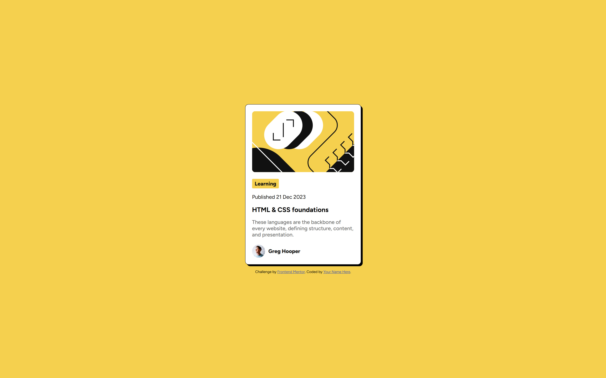

# Frontend Mentor - Blog preview card solution

This is a solution to the [Blog preview card challenge on Frontend Mentor](https://www.frontendmentor.io/challenges/blog-preview-card-ckPaj01IcS). Frontend Mentor challenges help you improve your coding skills by building realistic projects. 

## Table of contents

- [Overview](#overview)
  - [The challenge](#the-challenge)
  - [Screenshot](#screenshot)
  - [Links](#links)
- [My process](#my-process)
  - [Built with](#built-with)
  - [What I learned](#what-i-learned)
  - [Challenges I faced](#challenges-i-faced)
  - [Continued development](#continued-development)
  - [Useful resources](#useful-resources)
  - [AI Collaboration](#ai-collaboration)
- [Author](#author)

## Overview

### The challenge

Users should be able to:

- See hover and focus states for all interactive elements on the page

The goal of this challenge was to build a responsive blog preview card that matches the provided design as closely as possible using only HTML and CSS.

This project helped me practice layout structuring, CSS organization, and attention to visual details.

### Screenshot



### Links

- Solution URL: [Add solution URL here](https://www.frontendmentor.io/solutions/blog-preview-card-with-semantic-html-bem-and-mobile-first-css-UsOiba4WpK)
- Live Site URL: [Add live site URL here](https://victor-sc12.github.io/blog-preview-card-challenge/)

## My process

### Built with

- Semantic HTML5 markup
- CSS custom properties
- BEM naming convention
- Flexbox
- Mobile-first workflow
- Google Fonts (Figtree)

### What I learned

This challenge helped me strengthen several fundamental concepts:

**1. Writing cleaner semantic HTML**

  I used structural elements like `<main>`, `<article>`, `<header>`, and `<footer>` to give proper meaning to the content instead of relying only on `<div>` elements.
  
  This improved the clarity of the document structure and helped me think more intentionally about content hierarchy.

**2. Applying BEM methodology**

  I organized my classes using the BEM convention to make my CSS more maintainable and scalable.

  Example:
  ```css
  .card__img--hero {
    max-width: 100%;
    border-radius: 1rem;
  }
  ```

**3. Working with CSS variables**

  I defined color variables inside `:root` to centralize design decisions:
  ```css
  :root {
    --hsl-yellow-color: hsl(47, 88%, 63%);
    --hsl-white-color: hsl(0, 0%, 100%);
    --hsl-gray-500-color: hsl(0, 0%, 42%);
    --hsl-gray-950-color: hsl(0, 0%, 7%);
    --hsl-attribution-color: hsl(228, 45%, 44%);
  }
  ```
  This made my code cleaner and easier to update.

**4. Thinking mobile-first**

  Instead of designing for desktop first, I started with the base layout and then added adjustments using a media query.

  This helped me better understand how responsive design should be structured.

### Challenges I faced

- Estimating spacing values (margin, padding, font-size) based only on JPG designs.
- Matching the box-shadow and border style exactly as in the design.
- Deciding which elements should be interactive and how to style hover states properly.

These small visual details required more precision than I initially expected.

### Continued development

Going forward, I want to:
- Improve accessibility by adding clearer focus states.
- Refine my spacing system to be more consistent.
- Practice more advanced responsive techniques.
- Continue strengthening my understanding of CSS architecture.

### Useful resources

- [BEM Info - BEM naming convention](https://en.bem.info/methodology/naming-convention/) - This official source on the BEM methodology helped me correctly define the names of the element classes using the naming convention.
- [MDN - Basic concepts of flexbox](https://developer.mozilla.org/en-US/docs/Web/CSS/Guides/Flexible_box_layout/Basic_concepts) - This MND source served as a guide for me to define my flex layouts in the `<body>` and `<article>` elements that served as containers. 
- [manz.dev - La pseudoclase `:hover`](https://lenguajecss.com/css/pseudoclases/interaccion/#la-pseudoclase-hover) - This source allowed me to learn about the concept and behavior of the `:hover` pseudo-class, which was used as one of the selectors for this challenge.
- [manz.dev - La propiedad `cursor`](https://lenguajecss.com/css/interacciones/cursor-del-raton/#la-propiedad-cursor) - This source allowed me to learn about the concept and behavior of the `cursor` property, which was used as one of the properties for the interactivity required for this challenge.

### AI Collaboration

I used ChatGPT as a learning assistant during this project.

I mainly used it to:

- Review semantic HTML structure.
- Get feedback on BEM naming.
- Clarify CSS concepts.
- Improve documentation clarity.

I avoided copying full solutions and instead used AI to better understand my own decisions.

This helped me stay in control of the learning process while still receiving structured feedback.

## Author

- **Name**: Víctor Suquilanda
- **Frontend Mentor** - [@victor-sc12](https://www.frontendmentor.io/profile/victor-sc12)
- **GitHub** - [@victor-sc12](https://github.com/victor-sc12)